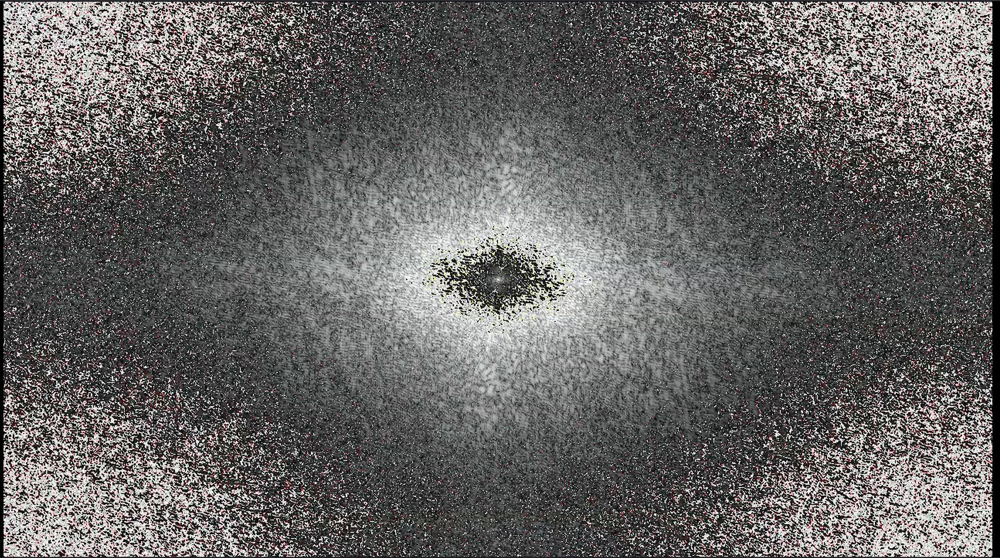
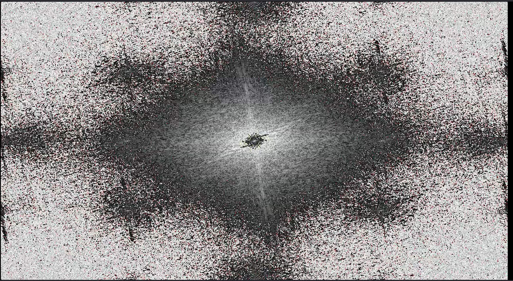
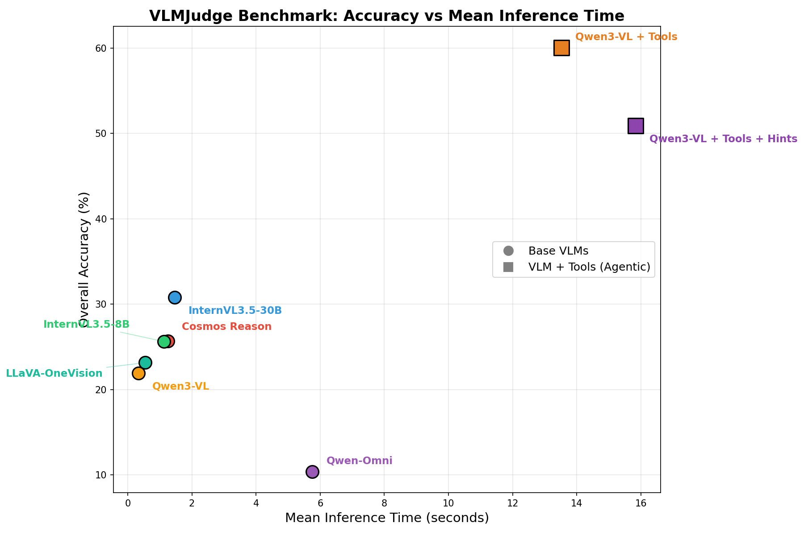

<div align="center">

# 🚗🔍 VLMJudge

### Can Vision-Language Models tell a *real* dashcam video from an *AI-generated* one?

**A benchmarking harness for Vision-Language Models on driving-video QA — built to find out whether VLMs can spot AI-generation artifacts.**

[](https://www.python.org/)
[](https://pytorch.org/)
[](https://github.com/vllm-project/vllm)
[](https://github.com/huggingface/transformers)

</div>

---

## 🧠 TL;DR

We built a video Question-Answering benchmark over **real and AI-generated driving clips**
(the in-house *cosmos-drive-dreams* / *cosmos-predict1* sets, plus *Pbench*) and threw a zoo of
**open- and closed-source VLMs** at it. Then we asked the hard question:

> *Do these models actually **see** that a video was generated, or do they just guess "real"?*

Spoiler: **off-the-shelf VLMs are nearly blind to generation artifacts** — but a **tool-using
agent** built around Qwen3-VL (optical flow + segmentation + FFT spectral analysis) closes most
of the gap. 📈

<div align="center">

| 🏆 Model | Accuracy |
|:---|:---:|
| 🔒 **Gemini-3-Flash** | **64.0 %** |
| 🤖 **Qwen3-VL + tools** | 60.1 % |
| 🤖 **Qwen3-VL + tools + hints** | 50.9 % |
| 🔒 GPT-5.4-mini | 39.1 % |
| InternVL3.5-30B | 30.8 % |
| Cosmos-Reason-7B | 25.7 % |
| InternVL3.5-8B | 25.6 % |
| LLaVA-OneVision-7B | 23.1 % |
| Qwen3-VL-30B | 21.9 % |
| Qwen3-Omni-30B | 10.4 % |

*Overall accuracy on the full driving-QA benchmark. Closed-source models evaluated: **GPT-5.4-mini**
and **Gemini-3-Flash**. See [`analysis_notebooks/`](analysis_notebooks/) for the breakdowns.*

</div>

---

## 🎯 The headline result: the "always say real" trap

In a controlled **real-vs-generated ablation** (100 clips: 50 real 🟢 / 50 generated 🔴), base VLMs
score near-perfectly on *real* videos and **catastrophically on *generated* ones** — because they
default to answering "real" almost every time:

| Model | 🟢 Real acc. | 🔴 Generated acc. |
|:---|:---:|:---:|
| Qwen3-VL-30B | 100 % | **0 %** |
| LLaVA-OneVision | 100 % | **0 %** |
| InternVL3.5-8B | 98 % | **0 %** |
| Qwen2.5-Omni | 98 % | **4 %** |
| InternVL3.5-30B | 96 % | **6 %** |
| Cosmos-Reason | 96 % | **22 %** |
| 🤖 **Qwen3-VL + agent** | 88 % | **70 %** |
| 🤖 **Qwen3-VL + agent + hints** | 96 % | **64 %** |

➡️ Giving the model **tools** — letting it *look* at frequency spectra, optical flow and
segmentation masks — is what finally makes generated artifacts visible. Reproduce it from
[`src/real_vs_generated/`](src/real_vs_generated/).

<div align="center">
<table>
<tr>
<td align="center"><b>🟢 Real frame — FFT spectrum</b><br></td>
<td align="center"><b>🔴 Generated frame — FFT spectrum</b><br></td>
</tr>
</table>

*The tell-tale spectral fingerprints of generation — the kind of cue a raw VLM never gets to see.*
</div>

---

## 🧭 What's inside

```
VLM-eval-rcp/
├── 📂 src/                              the pipeline code
│   ├── data_preparation/                raw parquet + MP4s → chat-formatted (video, question) JSONs
│   ├── evaluation/
│   │   ├── open_source/                 one inference script per local VLM (vLLM / transformers / lmdeploy)
│   │   └── closed_source/               GPT-5.4-mini & Gemini via the OpenAI / Google Batch APIs
│   ├── agentic/                         the Qwen3-VL tool-using agent (+ utils/ RAFT·SAM and fft/ tool)
│   ├── analysis/                        regex-clean raw outputs → join ground truth → accuracy (polars)
│   └── real_vs_generated/               self-contained 100-clip real-vs-generated study
├── 📓 analysis_notebooks/               the story in charts (benchmark, timing, questions, agent failures)
├── 📊 results/                          final per-model analyzed parquets
├── 📝 report/                           LaTeX write-up, figures, accuracy summaries
└── 🗂️ dataset/                          videos & prepared JSONs (gitignored — lives on the cluster PVC)
```

---

## 🏗️ The pipeline

```
                   ┌────────────────────────┐
  raw parquet +    │ src/data_preparation/  │   →  dataset/ … (video, question) message JSONs
  MP4 videos  ───► │     prep_data*.py      │
                   └────────────────────────┘
                            │
         ┌──────────────────┼─────────────────────────────────┐
         ▼                  ▼                                  ▼
 ┌──────────────────┐ ┌────────────────┐        ┌──────────────────────────┐
 │ evaluation/      │ │  src/agentic   │        │ evaluation/closed_source │
 │ open_source      │ │ Qwen3-VL +     │        │ GPT-5.4-mini /           │
 │ (vLLM/tfm)       │ │ tools @ :8000  │        │ Gemini (Batch API)       │
 └──────────────────┘ └────────────────┘        └──────────────────────────┘
         │                  │                                  │
         └──────────────────┴──────────────┬───────────────────┘
                                            ▼
                                  ┌───────────────────┐
                                  │   src/analysis/   │  regex-clean + ground-truth join (polars)
                                  └───────────────────┘
                                            ▼
                          📓 analysis_notebooks/  +  📝 report/
```

Every model is prompted to emit a fixed shape so the analysis regexes can parse it:

```
Feedback:::
Evaluation: <free-form reasoning>
Answer: <the actual answer>
```

> ⚠️ The output shape and the parsing regex in `src/analysis/answer_analysis.py` are coupled —
> change one and you change the other.

---

## 🤖 The agent

`src/agentic/main_multi_tools_v4.py` is the agent that produced the best results
(**Qwen3-VL + tools**, with and without hints). It speaks the OpenAI-compatible API of a **local
vLLM server that must already be running on port 8000** — serve the model, then run the agent:

```bash
# 1. serve the model
vllm serve .../Qwen3-VL-30B-A3B-Instruct --tensor-parallel-size 4 \
     --media-io-kwargs '{"video": {"num_frames": -1}}' --port 8000
# 2. run the agent (cwd must be src/agentic so utils/ and fft/ resolve)
cd src/agentic && python main_multi_tools_v4.py --num_workers 4
```

It registers three perception tools and forces a structured verdict:

| Tool | What it gives the model | Source |
|:---|:---|:---|
| 🌀 `get_motion_info` | optical-flow / motion summary | `agentic/utils/raft.py` (RAFT) |
| 🎭 `get_masks` | object segmentation masks | `agentic/utils/sam.py` (SAM 3) |
| 🔬 `get_frequency_analysis` | 2-D FFT power spectrum | `agentic/fft/compute_fft.py` |
| ✅ `final_answer` | the structured `{ evaluation, answer }` verdict | — |

The FFT spectrum is the key tool that exposes generation fingerprints. `main_multi_tools_timing.py`
is the latency-instrumented variant used for the timing study.

<div align="center">
&nbsp;&nbsp;
&nbsp;&nbsp;

<br><i>optical flow · segmentation · spectral / Hough cues</i>
</div>

---

## 🔒 Closed-source evaluation

[`src/evaluation/closed_source/`](src/evaluation/closed_source/) runs **GPT-5.4-mini** (OpenAI) and
**Gemini** (Google) through their **Batch APIs** with structured outputs (videos sampled at 1 fps →
5 base64 frames). The flow is fully scripted — chunk → upload → poll → merge → retry:

```bash
cd src/evaluation/closed_source/gpt
python run_gpt.py --mode batch       # build & submit batches (one at a time)
./cycle.sh --loop 600                # retrieve + merge + submit next retry, every 10 min
```

See [`src/evaluation/closed_source/gpt/README.md`](src/evaluation/closed_source/gpt/README.md) for
the full playbook; `gemini/` mirrors it for Google's Batch API. 🔑 API keys live in a gitignored
`.env` (copy the `example.env` template in each folder).

---

## 📊 Results & notebooks

| Notebook | What it shows |
|:---|:---|
| [`analysis_notebooks/benchmark_analysis.ipynb`](analysis_notebooks/benchmark_analysis.ipynb) | overall + per-category accuracy across all models & agents |
| [`analysis_notebooks/benchmark_timing.ipynb`](analysis_notebooks/benchmark_timing.ipynb) | accuracy ↔ inference-time trade-off |
| [`analysis_notebooks/agentic_failure_analysis.ipynb`](analysis_notebooks/agentic_failure_analysis.ipynb) | where the agent goes wrong (tool misuse, no answer) |
| [`analysis_notebooks/questions_analysis.ipynb`](analysis_notebooks/questions_analysis.ipynb) | question diversity & difficulty |

Cleaned per-model outputs live in `results/*.parquet` (one analyzed parquet per model, incl.
`GPT-5.4-mini_analyzed.parquet` and `Gemini_analyzed.parquet`); the LaTeX write-up, figures and
failure dumps live in [`report/`](report/). Run the notebooks **from `analysis_notebooks/`** so
their relative paths (`../dataset/…`, `../report/figures/…`) resolve.

<div align="center">

<br><i>Accuracy vs. inference time — the agent buys a lot of accuracy for ~14 s/clip.</i>
</div>

---

## 🗂️ Data, secrets & git hygiene

- **Datasets & model weights** live on a cluster filesystem (the path is hardcoded in the eval
  scripts). Locally they sit in `dataset/` — **gitignored**, never committed.
- **Heavy closed-source artifacts** (base64 request batches, raw results, frame caches) and bulky
  regenerable analysis blobs are gitignored too; only the *code* and small summaries are tracked.
- **Secrets** — `secrets.env`, `robot_secret.json`, and every `.env` are gitignored. Use the
  `example.env` templates.

---

<div align="center">

*VITA lab.*

</div>
