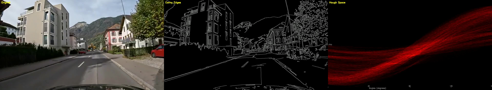

<div align="center">

# 🚗🔍 DriveJudge

### Can Vision-Language Models reliably judge generated driving simulations?

**A benchmark and tool-augmented evaluation framework for testing whether VLMs can judge safety, rule compliance, realism, artifacts, and temporal behavior in generated driving videos.**

[🤗 Dataset](https://huggingface.co/datasets/SeagullofLeman/DriveJudgeBench)

</div>

---

## 🧠 TL;DR

Generative driving simulators and visual world models can produce realistic-looking driving videos, but visual realism alone does not guarantee that a rollout is behaviorally correct. A generated video may contain unsafe maneuvers, traffic-rule violations, physically inconsistent motion, or subtle generation artifacts.

We introduce **DriveJudgeBench**, a benchmark of **1,597 curated synthetic driving clips** and **7,371 manually annotated video--question pairs** across six categories:

- reality detection
- artifact recognition
- safety assessment
- traffic-law compliance
- spatio-temporal reasoning
- visual understanding

Across a broad set of open- and closed-source VLMs, we find that off-the-shelf models are often unreliable judges of generated driving videos. They can recognize static scene cues such as traffic lights and road layout, but often fail to verify temporal behavior, detect artifacts, or identify traffic-rule violations.

To address this, we propose **DriveJudge**, a training-free tool-augmented VLM judge built on Qwen3-VL. DriveJudge grounds model decisions using optical flow, segmentation-based crop-and-zoom, and FFT-based frequency analysis, substantially improving reliability on safety-relevant and synthetic-content evaluation tasks.

<div align="center">

| 🏆 Model | Accuracy |
|:---|:---:|
| 🔒 **Gemini-3-Flash** | **64.0 %** |
| 🤖 **DriveJudge** | **60.1%** |
| 🤖 **DriveJudge + CoT** | 50.9 % |
| 🔒 GPT-5.4-mini | 39.1 % |
| InternVL3.5-30B | 30.8 % |
| Cosmos-Reason-7B | 25.7 % |
| InternVL3.5-8B | 25.6 % |
| LLaVA-OneVision-7B | 23.1 % |
| Qwen3-VL-30B | 21.9 % |
| Qwen3-Omni-30B | 10.4 % |

*Overall accuracy on the full driving-QA benchmark. Closed-source models evaluated: **GPT-5.4-mini**
and **Gemini-3-Flash**. See [`analysis_notebooks/`](analysis_notebooks/) for the breakdowns.*

</div>

---

## 🧭 What's inside

```
VLM-eval-rcp/
├── 📂 src/                              the pipeline code
│   ├── data_preparation/                raw parquet + MP4s → chat-formatted (video, question) JSONs
│   ├── evaluation/
│   │   ├── open_source/                 one inference script per local VLM (vLLM / transformers / lmdeploy)
│   │   └── closed_source/               GPT-5.4-mini & Gemini via the OpenAI / Google Batch APIs
│   ├── agentic/                         the Qwen3-VL tool-using agent (+ utils/ RAFT·SAM and fft/ tool)
│   ├── analysis/                        regex-clean raw outputs → join ground truth → accuracy (polars)
│   └── real_vs_generated/               self-contained 100-clip real-vs-generated study
├── 📓 analysis_notebooks/               the story in charts (benchmark, timing, questions, agent failures)
├── 📊 results/                          final per-model analyzed parquets
├── 📝 report/                           LaTeX write-up, figures, accuracy summaries
└── 🗂️ dataset/                          videos & prepared JSONs (gitignored — lives on the cluster PVC)
```

---

## 🏗️ The pipeline

```
                   ┌────────────────────────┐
  raw parquet +    │ src/data_preparation/  │   →  dataset/ … (video, question) message JSONs
  MP4 videos  ───► │     prep_data*.py      │
                   └────────────────────────┘
                            │
         ┌──────────────────┼─────────────────────────────────┐
         ▼                  ▼                                  ▼
 ┌──────────────────┐ ┌────────────────┐        ┌──────────────────────────┐
 │ evaluation/      │ │  src/agentic   │        │ evaluation/closed_source │
 │ open_source      │ │ Qwen3-VL +     │        │ GPT-5.4-mini /           │
 │ (vLLM/tfm)       │ │ tools @ :8000  │        │ Gemini (Batch API)       │
 └──────────────────┘ └────────────────┘        └──────────────────────────┘
         │                  │                                  │
         └──────────────────┴──────────────┬───────────────────┘
                                            ▼
                                  ┌───────────────────┐
                                  │   src/analysis/   │  regex-clean + ground-truth join (polars)
                                  └───────────────────┘
                                            ▼
                          📓 analysis_notebooks/  +  📝 report/
```

Every model is prompted to emit a fixed shape so the analysis regexes can parse it:

```
Feedback:::
Evaluation: <free-form reasoning>
Answer: <the actual answer>
```

> ⚠️ The output shape and the parsing regex in `src/analysis/answer_analysis.py` are coupled —
> change one and you change the other.

---

## 🤖 DriveJudge: the tool-augmented VLM judge

`src/agentic/main_multi_tools_v4.py` implements **DriveJudge**, the training-free tool-augmented judge reported in the paper.
It uses Qwen3-VL as the backbone and augments it with optical flow, segmentation, and FFT frequency analysis. 
It uses the OpenAI-compatible API of a **local
vLLM server that must already be running on port 8000** — serve the model, then run the agent:

```bash
# 1. serve the model
vllm serve .../Qwen3-VL-30B-A3B-Instruct --tensor-parallel-size 4 \
     --media-io-kwargs '{"video": {"num_frames": -1}}' --port 8000
# 2. run the agent (cwd must be src/agentic so utils/ and fft/ resolve)
cd src/agentic && python main_multi_tools_v4.py --num_workers 4
```

It registers three perception tools and forces a structured verdict:

| Tool | What it gives the model | Source |
|:---|:---|:---|
| 🌀 `get_motion_info` | optical-flow / motion summary | `agentic/utils/raft.py` (RAFT) |
| 🎭 `get_masks` | object segmentation masks | `agentic/utils/sam.py` (SAM 3) |
| 🔬 `get_frequency_analysis` | 2-D FFT power spectrum | `agentic/fft/compute_fft.py` |
| ✅ `final_answer` | the structured `{ evaluation, answer }` verdict | — |

The FFT spectrum is the key tool that exposes generation fingerprints. `main_multi_tools_timing.py`
is the latency-instrumented variant used for the timing study.

<div align="center">
&nbsp;&nbsp;
&nbsp;&nbsp;

<br><i>optical flow · segmentation · spectral / Hough cues</i>
</div>

---

## 🔒 Closed-source evaluation

[`src/evaluation/closed_source/`](src/evaluation/closed_source/) runs **GPT-5.4-mini** (OpenAI) and
**Gemini** (Google) through their **Batch APIs** with structured outputs (videos sampled at 1 fps →
5 base64 frames). The flow is fully scripted — chunk → upload → poll → merge → retry:

```bash
cd src/evaluation/closed_source/gpt
python run_gpt.py --mode batch       # build & submit batches (one at a time)
./cycle.sh --loop 600                # retrieve + merge + submit next retry, every 10 min
```

See [`src/evaluation/closed_source/gpt/README.md`](src/evaluation/closed_source/gpt/README.md) for
the full playbook; `gemini/` mirrors it for Google's Batch API. 🔑 API keys live in a gitignored
`.env` (copy the `example.env` template in each folder).

---

## 📊 Results & notebooks

| Notebook | What it shows |
|:---|:---|
| [`analysis_notebooks/benchmark_analysis.ipynb`](analysis_notebooks/benchmark_analysis.ipynb) | overall + per-category accuracy across all models & agents |
| [`analysis_notebooks/benchmark_timing.ipynb`](analysis_notebooks/benchmark_timing.ipynb) | accuracy ↔ inference-time trade-off |
| [`analysis_notebooks/agentic_failure_analysis.ipynb`](analysis_notebooks/agentic_failure_analysis.ipynb) | where the agent goes wrong (tool misuse, no answer) |
| [`analysis_notebooks/questions_analysis.ipynb`](analysis_notebooks/questions_analysis.ipynb) | question diversity & difficulty |

Cleaned per-model outputs live in `results/*.parquet` (one analyzed parquet per model, incl.
`GPT-5.4-mini_analyzed.parquet` and `Gemini_analyzed.parquet`); the LaTeX write-up, figures and
failure dumps live in [`report/`](report/). Run the notebooks **from `analysis_notebooks/`** so
their relative paths (`../dataset/…`, `../report/figures/…`) resolve.

<div align="center">

*VITA lab.*

</div>
